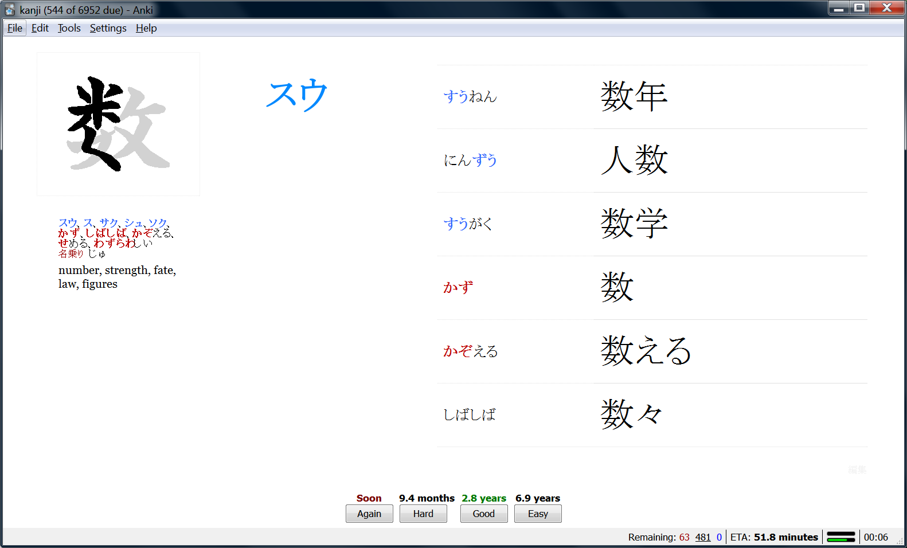
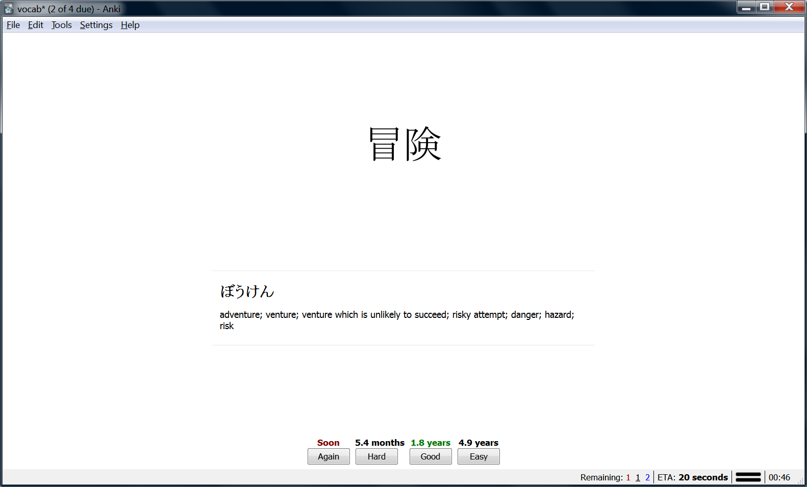

### Create Anki flashcards for kanji/vocab

- Focus on on-yomi
- Focus on handwriting for memorization

- Read words from text file
- Break down on-yomi/kun-yomi
- Normalize on-yomi e.g. **吉兆** きっちょう ⇨ きち.ちょう ⇨ キチ.チョウ
- KANJIDIC lookup
- EDICT lookup
- **Create kanji flashcards**: stroke order, meaning, reading, example words
- User can add more example words from priority-sorted lists
- Recognition: user is shown kanji only; must recall meaning, reading
- Production: user is shown reading, example words with kanji hidden; must hand-write kanji from memory
- **Create vocab flashcards**: word, translation, audio
- Recognition: user is shown word only; must recall meaning, pronunciation

